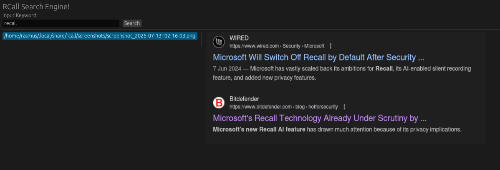

# Image Keyword Indexer

A Rust CLI tool to extract keywords from screenshots on Wayland using OCR, index them, and perform fast full-text searches using SQLite FTS5.

## Features

- Capture mode: capture screenshot, extract keywords and save in SQLite database.
- Search mode: search database by keywords quickly with SQLite full-text search.
- GUI mode: search for keywords and display images in a simple GUI.
- Supports multi-word keyword phrases.
- Lightweight and easy to use CLI with `clap`.
- Persistent keyword storage in a SQLite database with FTS5.



## Prerequisites

### Tesseract OCR

This project relies on the Tesseract OCR engine, which must be installed on your system.

#### Install Tesseract

- **Ubuntu/Debian**:

  ```bash
  sudo apt install tesseract-ocr libtesseract-dev
  ```

- **Arch Linux**:

  ```bash
  sudo pacman -S tesseract tesseract-data-eng
  ```

Make sure `tesseract` is available in your system PATH.

### Slurp and Grim

This project assumes you use `slurp` and `grim` to capture screenshots on Wayland.

#### Install Slurp and Grim

- **Ubuntu/Debian**:

  ```bash
  sudo apt install slurp grim
  ```

- **Arch Linux**:

  ```bash
  sudo pacman -S slurp grim
  ```

## Building

Make sure you have [Rust](https://www.rust-lang.org/tools/install) installed.

```bash
git clone https://github.com/rdavid20/rcall.git
cd rcall
cargo build --release
```

## Usage
The program can be used either by use of the compiled binary or by using Cargo:

### Capture Mode using Cargo

```bash
cargo run -- --capture
```

This will extract keywords from your configured images and store them in the database.

### Search Mode using Cargo

```bash
cargo run -- --search ai robotics "machine learning"
```

Searches the database for images matching any of the given keywords and returns the paths.

### GUI Mode
```bash
cargo run -- --gui
```

Runs a simple GUI created using egui.


## Command-line options

| Flag            | Description                              |
|-----------------|----------------------------------------|
| `-c, --capture` | Activate capture mode                   |
| `-s, --search`  | Search mode with one or more keywords  |

Run `cargo run -- --help` for full details.

## License

MIT License © 2025 Rasmus Davidsen
